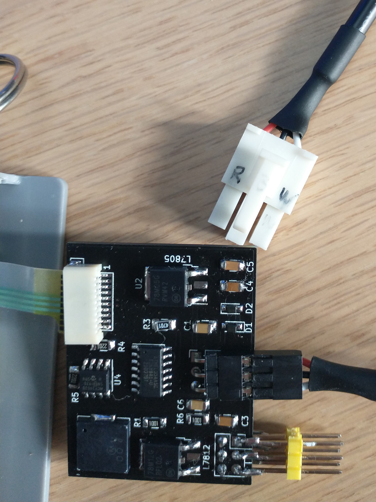
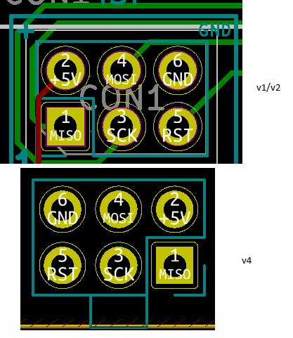

# DIY
As most people prefer the fully assembled version, even as a base to their own software, I've moved the DIY notes to this section to reduce clutter and confusion.

## Cable
If you want to create your own cable, the connector is AMP VAL-U-LOK by TE Connectivity - PN 1586106-3. Don't forget the crimp pins - Part Number 1586317-1 for 26-22AWG.

Pinout on a DIY cable. In this case Red is positive, black is negative, white is LIN.



Otherwise, the existing cable can be unsoldered from the board and fitted with a standard 2.54mm pitch header. Red is positive (24VDC), white is negative, blue is LIN.

## Atmega Fuses

Don't forget to set fuses on your board for the appropriate oscillator!

ATTiny 841 - 8Mhz internal
```
avrdude -c usbtiny -p t841 -U lfuse:w:0xe2:m
```

ATiny 841 - To preserve memory-slots/eeprom when reflashing the image.
```
avrdude -c usbtiny -p t841 -U hfuse:w:0xd4:m
```

# Hacking and Contributing

## Warnings
* Plugging in any connectors backwards can probably damage your desk. Be very careful when working on your circuit.
* The power supply is 24V, and raises higher when motors are in operation! (Between 35-37V) This can generate a decent amount of heat for the linear regulators. **Make sure to use genuine name brand regulators**, and check the heat output before putting it back inside the casing and attaching it to your tabletop. Ensure to spec the main filtering capacitor appropriately (50v).
* Do not use ATTinyCore 1.2.2, it contains bugs that will prevent proper operation.

## Operation
* Use up/down buttons as per factory module (long press/hold)
* To store in a memory slot, push the up/down button a certain number of times, but long-hold the last press until you hear some beeps corresponding to the memory position that has been saved.
* To recall a saved position N, push the up/down button N times. Where N >= 2.
* Up and down buttons have separate memory settings

## pio

I'm using <a href="https://platform.io">platform.io</a> for development. Integrated into <a href="https://code.visualstudio.com/">Visual Studio Code</a>, it's miles above the Arduino IDE. Note that while we're using pio and vscode, the actual code is still using Arduino libraries - we are not coding
native AVR code. In other words, there are still `setup()` and `loop()` blocks, and all Arduino modules are available (but handled via pio).

You can find plenty of tutorials online on getting started - <a href="https://circuitdigest.com/microcontroller-projects/programming-arduino-using-platform-io-to-blink-an-led">this one</a> is a good start.

## programming
As the megadesk does not have any USB connectivity, you will need a programmer to connect and program the megadesk via PC.

My go-to programmer is the <a href="https://www.sparkfun.com/products/9825">Sparkfun Pocket AVR Programmer</a>. It has a small switch which will either power the device, or not. Having power available is nice for one-off flashing, but if you plan on developing on an AVR, it can be useful to use serial logging. As the megadesk would already be powered up by the desk itself, you do not want to have the programmer supplying power as well.

## programming header
The header is a standard 6 pin 2.54mm pitch connector (eg. https://www.digikey.ca/en/products/detail/amphenol-icc-fci/68602-406HLF/1657836 ). If you'd like to permanent attach it and have a cable running out for serial IO or development, a right angle header such as a 68459-406HLF-ND can be used as an alternative.

On board versions v1,v2 and v5, this is a standard connector which will accept a typical AVR programming cable on the **top** of the board. 

For v4 boards, as many people were not developing, I flipped it upside down so I could program the boards easier when making the boards. As a result, you will need to check the pin mapping accordingly for a top mounted programming header, or, flash from the bottom side of the board.



## Other Stuff
### Current Measurements
16mA on the Atmega 328P, 3mA on the MCP2003B.

### PCB Revisions
There's no major differences that come to mind. If you want to cook your own, check out the v5 release. v6 moves to smaller SMD passive components to make mass-assembly a bit easier. The smaller passives are done with a pick and place and the rest by hand.
