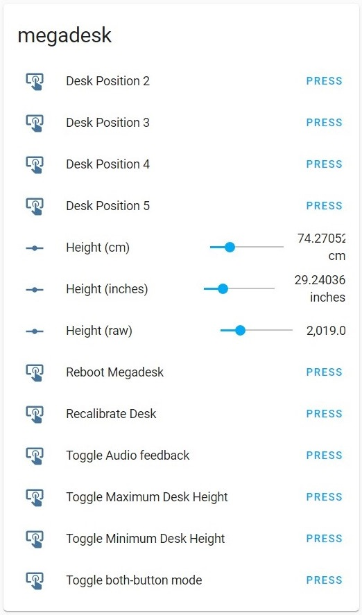

# esphome configuration
This is only an example for the Wemos D1 Mini. Any esphome compatible device can be used.

Do NOT use the 5V from the Megadesk to power your esphome controller. Megadesk does not have the ability to dissipate
the amount of heat produced by the linear regulators with a high-power device. These devices can requires 100-300mA of current. For comparison, the megadesk itself only requires 10-15mA.

There exists one device with a built-in buck converter that could take the 24V power - https://www.ezsbc.com/product/wifi01-sw/ (unaffiliated and not tested)

Connections will be
```
MISO -> RX
SCK -> TX
GND -> GND
```


## esphome custom component
(Store this file in your esphome configuration directory, for example `megadesk.h`)
```
#include "esphome.h"

class Megadesk : public Component, public Sensor, public UARTDevice {
 public:
  Megadesk(UARTComponent *parent) : UARTDevice(parent) {}

  Sensor *raw_height = new Sensor();
  Sensor *min_height = new Sensor();
  Sensor *max_height = new Sensor();

  void setup() override {}

  int digits=0;

  int readdigits()
  {
    int r;
    while ((r = read()) > 0) {
      if ((r < 0x30) || (r > 0x39)) {
        // non-digit we're done, return what we have
        return digits;
      }
      // it's a digit, add with base10 shift
      digits = 10*digits + (r-0x30);
      // keep reading...
    }
    return -1;
  }

  void recvData()
  {
    const int numChars = 2;
    const int numFields = 4; // read/store all 4 fields for simplicity, use only the last 3.
    // static variables allows segmented/char-at-a-time decodes
    static uint16_t receivedBytes[numFields];
    static uint8_t ndx = 0;
    int r; // read char/digit

    // read 2 chars
    while ((ndx < numChars) && ((r = read()) != -1))
    {
      if ((ndx == 0) && (r != '>'))
      {
        // first char is not Tx, keep reading...
        continue;
      }
      receivedBytes[ndx] = r;
      ++ndx;
    }
    // read ascii digits
    while ((ndx >= numChars) && ((r = readdigits()) != -1)) {
      receivedBytes[ndx] = r;
      digits = 0; // clear
      if (++ndx == numFields) {
        // thats all 4 fields. parse/process them now and break-out.
        parseData(receivedBytes[1],
                  receivedBytes[2],
                  receivedBytes[3]);
        ndx = 0;
        return;
      }
    }
  }

  void parseData(byte command, uint16_t position, uint8_t push_addr)
  {
    if (command == '=')
    {
      raw_height->publish_state(position);
    } else if (command == 'R'){
      if (push_addr == 11){
        min_height->publish_state(position);
      } else if (push_addr == 12){
        max_height->publish_state(position);
      }
    }
  }

  void loop() override {
    while (available()) {
      recvData();
    }
  }
};
```


## esphome YAML
```
esphome:
  name: megadesk
  platform: ESP8266
  board: d1_mini
  includes:
    - megadesk.h
  on_boot:
    priority: -100
    then:
      - delay: 1s
      - uart.write: "<C0.0."
      - delay: 1s
      - uart.write: "<R0.11."
      - delay: 1s
      - uart.write: "<R0.12."

logger:
  baud_rate:0

api:
  password: ""

ota:
  password: ""

wifi:
  ssid: "xxxxxxxxxxx"
  password: "xxxxxxxxx"

  ap:
    ssid: "Desk Fallback Hotspot"
    password: "xxxxxxxxxx"

captive_portal:

web_server:
  port: 80

uart:
  id: uart_desk
  baud_rate: 115200
  tx_pin: D0
  rx_pin: D1

sensor:
  - platform: custom
    lambda: |-
      auto megadesk = new Megadesk(id(uart_desk));
      App.register_component(megadesk);
      return { megadesk->raw_height, megadesk->min_height, megadesk->max_height };
    sensors:
    - id: megadesk_raw
      internal: true
      on_value:
        then:
          - component.update: megadesk_height_inches
          - component.update: megadesk_height_cm
          - component.update: megadesk_height_raw
    - name: "Megadesk Minimum Height"
    - name: "Megadesk Maximum Height"

number:
  - platform: template
    name: "Megadesk Height (inches)"
    id: megadesk_height_inches
    min_value: 23
    max_value: 47
    step: 0.53
    mode: slider
    update_interval: never
    unit_of_measurement: 'inches'
    #NewValue = (((OldValue - OldMin) * (NewMax - NewMin)) / (OldMax - OldMin)) + NewMin
    lambda: |-
      return ((((id(megadesk_raw).state - 299) * (47 - 23)) / (6914 - 299)) + 23);
    set_action:
      - number.set:
          id: megadesk_height_raw
          value: !lambda "return int((((x - 23) * (6914 - 299)) / (47 - 23)) + 299);"
  - platform: template
    name: "Megadesk Height (cm)"
    id: megadesk_height_cm
    min_value: 58.42
    max_value: 118.745
    step: 0.53
    mode: slider
    update_interval: never
    unit_of_measurement: 'cm'
    #NewValue = (((OldValue - OldMin) * (NewMax - NewMin)) / (OldMax - OldMin)) + NewMin
    lambda: |-
      return ((((id(megadesk_raw).state - 299) * (119.38 - 58.42)) / (6914 - 299)) + 58.42);
    set_action:
      - number.set:
          id: megadesk_height_raw
          value: !lambda "return int((((x - 58.42) * (6640 - 299)) / (119.38 - 58.42)) + 299);"
  - platform: template
    name: "Megadesk Height (raw)"
    id: megadesk_height_raw
#    internal: true
    min_value: 299
    max_value: 6640
    step: 1
    mode: slider
    update_interval: never
    lambda: |-
      return id(megadesk_raw).state;
    set_action:
      - uart.write: !lambda |-
          char buf[20];
          sprintf(buf, "<=%i,.", int(x));
          std::string s = buf;
          return std::vector<unsigned char>( s.begin(), s.end() );

button:
  - platform: template
    name: "Desk Position 2"
    on_press:
      then:
        - uart.write: "<L0,2."
  - platform: template
    name: "Desk Position 3"
    on_press:
      then:
        - uart.write: "<L0,3."
  - platform: template
    name: "Desk Position 4"
    on_press:
      then:
        - uart.write: "<L0,4."
  - platform: template
    name: "Desk Position 5"
    on_press:
      then:
        - uart.write: "<L0,5."
  - platform: template
    name: "Toggle Minimum Desk Height"
    on_press:
      then:
        - uart.write: "<L0,11."
        - uart.write: "<R0,11."
  - platform: template
    name: "Toggle Maximum Desk Height"
    on_press:
      then:
        - uart.write: "<L0,12."
        - uart.write: "<R0,12."
  - platform: template
    name: "Recalibrate Desk"
    on_press:
      then:
        - uart.write: "<L0,14."
  - platform: template
    name: "Reboot Megadesk"
    on_press:
      then:
        - uart.write: "<L0,15."
  - platform: template
    name: "Toggle Audio feedback"
    on_press:
      then:
        - uart.write: "<L0,17."
  - platform: template
    name: "Toggle both-button mode"
    on_press:
      then:
        - uart.write: "<L0,18."

interval:
  - interval: 300s
    then:
      - uart.write: "<C0.0."
```

### example in Home Assistant dashboard

